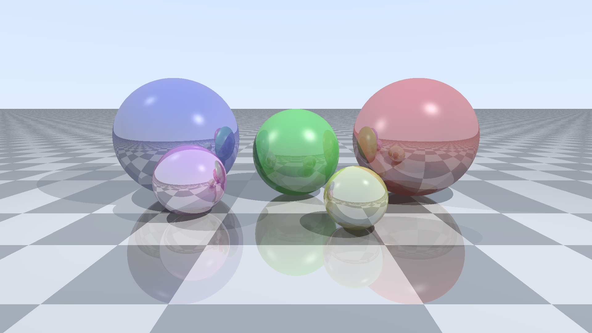

# Ray Tracer - Results

## Task

Render a fixed 3D scene using ray tracing, outputting the result as a PPM P6 binary image to stdout.

**Scene definition:**

Camera at (0, 1.5, -5) looking at (0, 0.5, 0) with 60 degree vertical FOV. Up vector (0, 1, 0).

Ground plane at y=0, checkerboard pattern alternating (0.8, 0.8, 0.8) and (0.3, 0.3, 0.3) with square size 1.0, reflectivity 0.3.

Five spheres:
| Center         | Radius | Color           | Reflectivity | Specular |
|----------------|--------|-----------------|-------------|----------|
| (-2, 1, 0)     | 1.0    | (0.9, 0.2, 0.2) | 0.3         | 50       |
| (0, 0.75, 0)   | 0.75   | (0.2, 0.9, 0.2) | 0.2         | 30       |
| (2, 1, 0)      | 1.0    | (0.2, 0.2, 0.9) | 0.4         | 80       |
| (-0.75, 0.4, -1.5) | 0.4 | (0.9, 0.9, 0.2) | 0.5      | 100      |
| (1.5, 0.5, -1)  | 0.5   | (0.9, 0.2, 0.9) | 0.6         | 60       |

Two point lights:
| Position       | Intensity |
|----------------|-----------|
| (-3, 5, -3)   | 0.7       |
| (3, 3, -1)    | 0.4       |

Ambient light intensity: 0.1.

**Required rendering features:**
- Phong shading (ambient + diffuse + specular)
- Hard shadows via ray casting to each light source
- Recursive reflections with max depth 5
- Gamma correction (gamma = 2.2) applied before output

**Constraints:**
- Single-threaded execution only, no GPU or SIMD acceleration
- Standard library math only (no external rendering or math libraries)
- Runtime rendering required (no pre-computed or embedded image data)
- 64-bit floating-point precision

## Methodology

- **Resolution:** 1920x1080
- **Runs:** 3 (median)
- **Warmup:** 1
- **Containers:** Docker with `--network=none --memory=512m --cpus=1`

## Runtime Performance Rankings

| Rank | Language | Runtime | vs Fastest | Image Size |
|-----:|----------|--------:|-----------:|-----------:|
| 1 | **Rust** | 891.9 ms | 1.0x | 27.84 MB |
| 2 | **C** | 976.2 ms | 1.1x | 26.94 MB |
| 3 | **JavaScript** | 1.279 s | 1.4x | 75.76 MB |
| 4 | Go | 1.330 s | 1.5x | 28.08 MB |
| 5 | Python | 20.016 s | 22.4x | 41.19 MB |

## Rendered Output

### Rust


### C


### JavaScript


### Go



### Python


## How to Run

```bash
python showdown.py all raytracer
```
