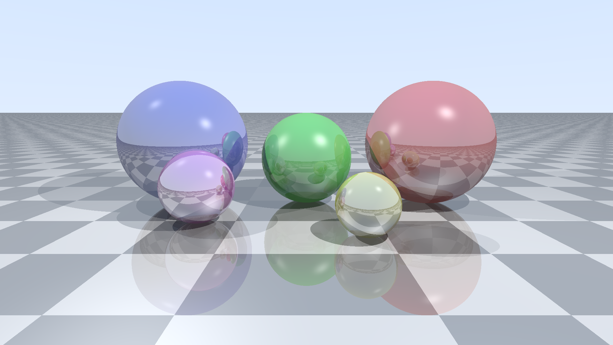
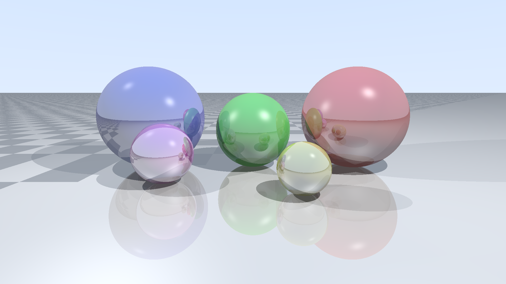
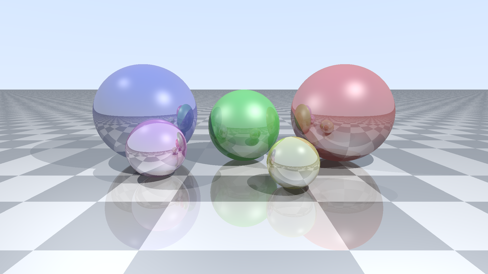
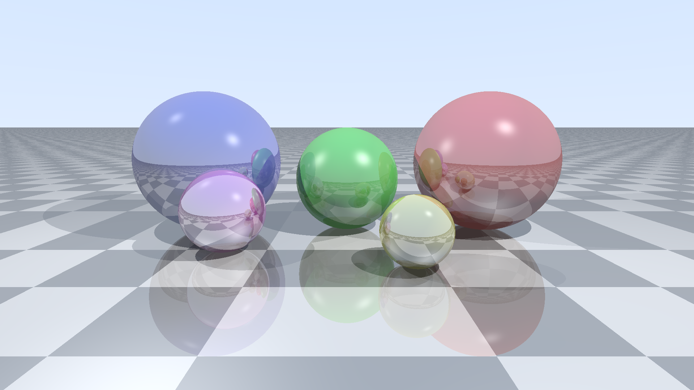

# Ray Tracer - Results

## Task

Render a fixed 3D scene using ray tracing, outputting the result as a PPM P6 binary image to stdout.

**Scene definition:**

Camera at (0, 1.5, -5) looking at (0, 0.5, 0) with 60 degree vertical FOV. Up vector (0, 1, 0).

Ground plane at y=0, checkerboard pattern alternating (0.8, 0.8, 0.8) and (0.3, 0.3, 0.3) with square size 1.0, reflectivity 0.3.

Five spheres:
| Center         | Radius | Color           | Reflectivity | Specular |
|----------------|--------|-----------------|-------------|----------|
| (-2, 1, 0)     | 1.0    | (0.9, 0.2, 0.2) | 0.3         | 50       |
| (0, 0.75, 0)   | 0.75   | (0.2, 0.9, 0.2) | 0.2         | 30       |
| (2, 1, 0)      | 1.0    | (0.2, 0.2, 0.9) | 0.4         | 80       |
| (-0.75, 0.4, -1.5) | 0.4 | (0.9, 0.9, 0.2) | 0.5      | 100      |
| (1.5, 0.5, -1)  | 0.5   | (0.9, 0.2, 0.9) | 0.6         | 60       |

Two point lights:
| Position       | Intensity |
|----------------|-----------|
| (-3, 5, -3)   | 0.7       |
| (3, 3, -1)    | 0.4       |

Ambient light intensity: 0.1.

**Required rendering features:**
- Phong shading (ambient + diffuse + specular)
- Hard shadows via ray casting to each light source
- Recursive reflections with max depth 5
- Gamma correction (gamma = 2.2) applied before output

**Constraints:**
- Single-threaded execution only, no GPU or SIMD acceleration
- Standard library math only (no external rendering or math libraries)
- Runtime rendering required (no pre-computed or embedded image data)
- 64-bit floating-point precision

## Methodology

- **Resolution:** 1920x1080
- **Runs:** 3 (median)
- **Warmup:** 1
- **Containers:** Docker with `--network=none --memory=512m --cpus=1`

## Runtime Performance Rankings

| Rank | Language | Runtime | vs Fastest | Image Size |
|-----:|----------|--------:|-----------:|-----------:|
| 1 | **C++** | 837.1 ms | 1.0x | 27.41 MB |
| 2 | **Rust** | 867.1 ms | 1.0x | 27.84 MB |
| 3 | **Crystal** | 887.2 ms | 1.1x | 27.36 MB |
| 4 | Kotlin | 926.3 ms | 1.1x | 99.14 MB |
| 5 | C | 950.4 ms | 1.1x | 26.94 MB |
| 6 | C# (.NET 9 AOT) | 951.1 ms | 1.1x | 27.55 MB |
| 7 | C# (.NET 10 AOT) | 953.6 ms | 1.1x | 27.50 MB |
| 8 | Zig | 1.024 s | 1.2x | 27.43 MB |
| 9 | Swift | 1.130 s | 1.3x | 45.15 MB |
| 10 | Haskell | 1.133 s | 1.4x | 27.38 MB |
| 11 | Lua | 1.142 s | 1.4x | 27.62 MB |
| 12 | Fortran | 1.146 s | 1.4x | 27.59 MB |
| 13 | Java | 1.163 s | 1.4x | 95.09 MB |
| 14 | JavaScript | 1.262 s | 1.5x | 75.76 MB |
| 15 | Go | 1.262 s | 1.5x | 28.08 MB |
| 16 | D | 1.289 s | 1.5x | 27.29 MB |
| 17 | OCaml | 1.310 s | 1.6x | 27.76 MB |
| 18 | Nim | 1.324 s | 1.6x | 26.96 MB |
| 19 | Scala | 1.363 s | 1.6x | 101.44 MB |
| 20 | Ada | 1.448 s | 1.7x | 27.48 MB |
| 21 | Dart | 1.460 s | 1.7x | 29.70 MB |
| 22 | TypeScript | 1.645 s | 2.0x | 75.57 MB |
| 23 | C# (.NET 9) | 2.613 s | 3.1x | 77.80 MB |
| 24 | C# (.NET 10) | 2.620 s | 3.1x | 79.37 MB |
| 25 | Pascal | 3.687 s | 4.4x | 27.12 MB |
| 26 | Erlang | 13.219 s | 15.8x | 118.77 MB |
| 27 | Elixir | 15.441 s | 18.4x | 120.31 MB |
| 28 | PHP | 17.452 s | 20.8x | 172.25 MB |
| 29 | Python | 19.744 s | 23.6x | 41.19 MB |
| 30 | Bash | 38.023 s | 45.4x | 27.95 MB |
| 31 | AWK | 38.039 s | 45.4x | 27.95 MB |
| 32 | Ruby | 52.998 s | 63.3x | 66.13 MB |
| 33 | Perl | 94.019 s | 112.3x | 58.55 MB |

## Rendered Output

### C++


### Rust


### Crystal


### Kotlin


### C


### C# (.NET 9 AOT)


### C# (.NET 10 AOT)


### Zig


### Swift


### Haskell


### Lua


### Fortran


### Java


### JavaScript


### Go


### D


### OCaml


### Nim


### Scala


### Ada


### Dart


### TypeScript



### C# (.NET 9)


### C# (.NET 10)


### Pascal


### Erlang



### Elixir



### PHP


### Python


### Bash


### AWK



### Ruby


### Perl


## How to Run

```bash
python showdown.py all raytracer
```
